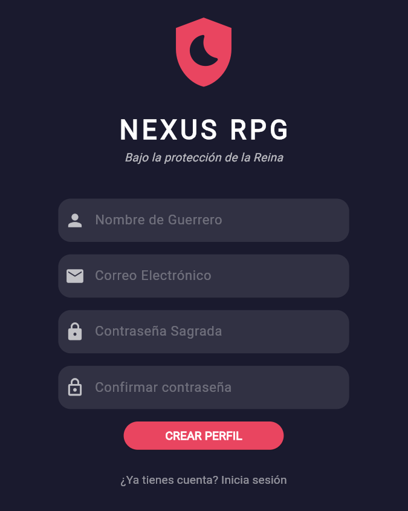
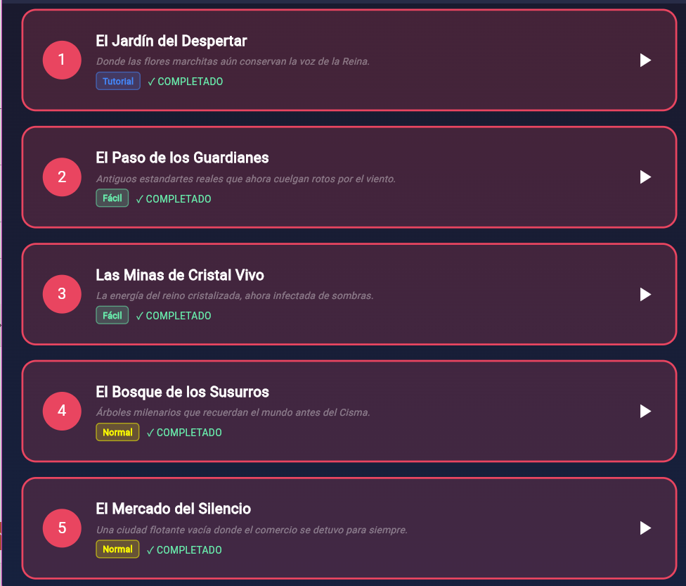
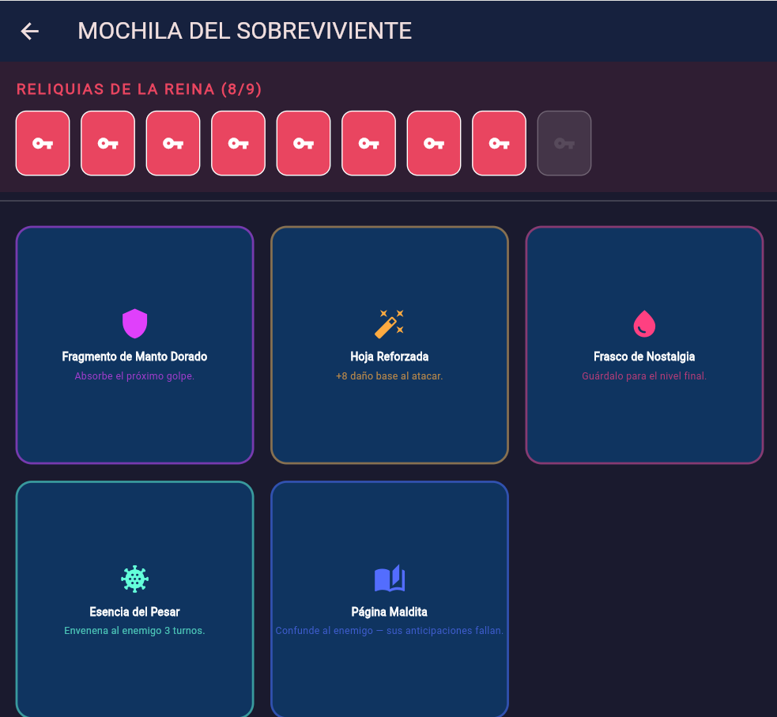
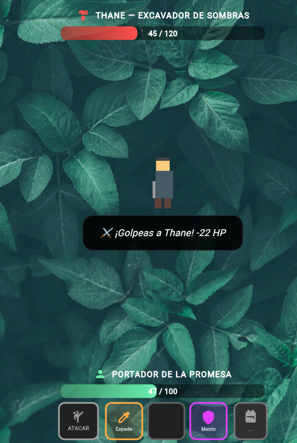

<div align="center">

# ⚔️ Nexus RPG — The Crown Schism


Full-stack cross-platform RPG that solves the challenge of flexible item storage by leveraging MongoDB's embedded document model to manage heterogeneous inventories across 10 narrative levels.

</div>

---

## 📋 Table of Contents

- [⚡ Getting Started](#-getting-started)
  - [Prerequisites](#prerequisites)
  - [Installation](#installation)
- [📸 Screenshots](#-screenshots)
- [💻 Usage Examples](#-usage-examples)
- [🏛️ Architecture & Tech Stack](#️-architecture--tech-stack)
- [🗺️ Levels](#️-levels)
- [🎒 Item System](#-item-system)
- [🤖 Running Tests](#-running-tests)
- [🤝 Contributing](#-contributing)
- [👥 Team Members](#-team-members)
- [📄 License](#-license)

---

## ⚡ Getting Started

Follow these instructions to set up a local copy of the project on your machine for development and testing purposes.

### Prerequisites

- Git
- Flutter SDK `>=3.41.7` (stable channel)
- Dart `>=3.11.5`
- Node.js `>=24.15.0`
- npm (included with Node.js)
- A [MongoDB Atlas](https://www.mongodb.com/atlas) account with a configured cluster

### Installation

1. Clone the repository:

```bash
git clone https://github.com/Rosario-sanchez-marin/CBTis_47-RPG-Inventory-System.git
```

2. Navigate to the project directory:

```bash
cd CBTis_47-RPG-Inventory-System
```

3. Install backend dependencies:

```bash
cd nexus_backend
npm install
```

4. Set up environment variables:

```bash
cp .env.example .env
```

Then open `.env` and fill in your MongoDB Atlas credentials:

```env
MONGODB_URI=mongodb://<username>:<password>@<cluster-shard-00-00>.<cluster-id>.mongodb.net:27017,.../RPG_Inventory_System?ssl=true&replicaSet=atlas-xxxxx-shard-0&authSource=admin&appName=<appName>
PORT=3000
```

> `PORT` defaults to `3000`. The Flutter app points to `localhost:3000` — keep them in sync.

5. Start the backend server:

```bash
node server.js
```

Expected output:

```
🚀 API running on port 3000
✅ Atlas connected
```

6. Open a new terminal, navigate to the Flutter project and install dependencies:

```bash
cd ../videojuego_rpg
flutter pub get
```

7. Run the app:

```bash
# Web (Chrome)
flutter run -d chrome

# Android (device or emulator must be connected)
flutter run -d android

# iOS (macOS only, requires Xcode)
flutter run -d ios
```

---

## 📸 Screenshots

<table>
  <tr>
    <td align="center"><b>🖼️ Login & Registration</b></td>
    <td align="center"><b>🗺️ World Map — Level Selection</b></td>
  </tr>
  <tr>
    <td></td>
    <td></td>
  </tr>
  <tr>
    <td align="center"><b>🎒 Survivor's Backpack</b></td>
    <td align="center"><b>⚔️ Combat — Battle Hotbar</b></td>
  </tr>
  <tr>
    <td></td>
    <td></td>
  </tr>
</table>

> 🎬 **¡Mira nuestro desarrollo en acción!** > Puedes ver todo el proceso y el gameplay en nuestro canal de YouTube:  
> 🔗 [**Nexus RPG Dev — Ver Devlog en YouTube**](https://youtu.be/0C-j4QkwRXA?si=HXXg2Hy6XNqPC-IN)

---

## 💻 Usage Examples

Below are the main flows you can interact with once the app is running.

### 1. Register a new player (US-TF-1-1)

Fill in the form on the login screen and press **"CREATE PROFILE"**. The system will:

- Create a new document in the `players` collection in MongoDB
- Initialize the inventory with an **Iron Sword** and a **Health Potion**
- Save the session locally with `SharedPreferences`

### 2. Manage your inventory (US-TF-2-1 / US-TF-2-2)

- Navigate to **"SURVIVOR'S BACKPACK"** from the map screen
- Each item displays its type, name, and stats fetched in real time from Atlas
- Items are **view-only** from the backpack — potions and special items can only be used **during combat**
- Drag items from the backpack panel into the hotbar slots during combat to equip them

### 3. Fight in a level (US-TF-2-2)

- Enter any unlocked level from the map
- The **BattleHotbar** shows: `ATTACK` button + 3 item slots + `🎒` backpack button
- Tap the backpack to open the inventory panel and drag items into slots
- Tap an equipped item slot to use it in combat
- Potions restore HP, shields absorb damage, and special items trigger unique effects

### 4. Complete a level and unlock the next one (US-TF-3-1)

- Defeat the boss to earn XP and a **Queen's Key**
- Return to the map — the next level unlocks based on `max_level_reached` in MongoDB
- Rewards (keys and special items) are only granted once per level — repeating a level gives XP but no duplicate items

---

## 🏛️ Architecture & Tech Stack

This project follows a **Client-Server architecture** with a clear separation between the frontend, backend, and database layers.

### Frontend

- **Core Language:** Dart
- **Framework:** Flutter (cross-platform — Web, Android, iOS)
- **State Management:** `StatefulWidget` + `FutureBuilder`

### Backend

- **Core Language:** JavaScript
- **Framework:** Node.js + Express
- **Architecture:** REST API with modular routing (`/auth`, `/player`, `/inventory`, `/levels`)

### Database

- **Database:** MongoDB Atlas
- **ODM:** Mongoose
- **Model:** Embedded Document Model (player owns items inside the same document)

### Communication

- **Protocol:** HTTP/JSON
- **Security:** bcrypt for password hashing (NFR-05)
- **CORS:** Enabled for cross-origin Flutter Web requests

### Project Structure

```
NEXUS_RPG_PROJECT/
├── nexus_backend/                  ← Node.js REST API
│   ├── models/
│   │   ├── Player.js               ← Mongoose schema (player + embedded inventory)
│   │   └── Level.js                ← Level metadata schema
│   ├── routes/
│   │   ├── auth.js                 ← POST /auth/register, /auth/login
│   │   ├── player.js               ← GET /player/:id, PATCH /player/level, PATCH /player/reset-hp
│   │   ├── inventory.js            ← GET, POST, DELETE /inventory
│   │   └── levels.js               ← GET /levels
│   ├── tests/
│   │   ├── auth.test.js
│   │   ├── inventory.test.js
│   │   └── player.test.js
│   └── server.js                   ← Entry point
└── videojuego_rpg/
    └── lib/
        ├── data/
        │   └── services/
        │       └── api_service.dart ← All HTTP calls to the backend
        └── ui/
            ├── screens/
            │   ├── login_screen.dart
            │   ├── map_screen.dart
            │   ├── inventory_screen.dart
            │   ├── level_one_screen.dart
            │   ├── level_two_screen.dart
            │   ├── level_three_screen.dart
            │   ├── level_four_screen.dart
            │   ├── level_five_screen.dart
            │   ├── level_six_screen.dart
            │   ├── level_seven_screen.dart
            │   └── level_eight_screen.dart
            └── widgets/
                └── battle_hotbar.dart  ← Reusable combat hotbar (drag & drop)
```

---

## 🗺️ Levels

| # | Name | Boss | Difficulty | XP | New Item |
|---|------|------|------------|----|----------|
| 1 | The Garden of Awakening | Corrupted Guard | Tutorial | 150 | Garden Key |
| 2 | The Guardians' Pass | Kael + Shadow of the Threshold | Easy | 250 | Golden Mantle Fragment |
| 3 | The Living Crystal Mines | Thane, the Shadow Excavator | Normal | 350 | Glacial Crystal Essence |
| 4 | The Forest of Whispers | Sylvara, the Silent Huntress | Normal | 450 | Echo Arrow |
| 5 | The Market of Silence | Voryn, the Corrupted Merchant | Hard | 550 | Nostalgia Flask |
| 6 | The Forge of Hope | Ignar, the Ash Smith | Hard | 650 | Reinforced Blade |
| 7 | The Swamp of Sorrow | Mireya, the Eternal Mourner | Hard | 750 | Sorrow Essence |
| 8 | The Great Crystal Library | Seraphel, the Corrupted Archivist | Very Hard | 850 | Cursed Page |
| 9 | The Watchtower of Sacrifice | — | Epic | — | — |
| 10 | The Throne of the Schism | Malakor | Epic | — | — |

> Level 10 requires all 9 Queen's Keys to enter.
>
> ⚠️ Levels 9 and 10 are currently under active development.

---

## 🎒 Item System

The inventory uses MongoDB's embedded document model with a flexible `stats` object that varies per item type. Mongoose validates the stats structure based on `type`.

| Item | `item_id` | Type | Effect in Combat |
|------|-----------|------|-----------------|
| Iron Sword | — | `weapon` | Base attack damage (15 + random) |
| Reinforced Blade | `hoja_reforzada` | `weapon` | Higher base damage (23 + random) |
| Health Potion | — | `consumable` | Restores HP (heal value from stats) |
| Golden Mantle Fragment | `manto_01` | `shield` | Absorbs next hit at half damage |
| Glacial Crystal Essence | `esencia_glacial` | `consumable` | Freezes enemy for 2 turns |
| Echo Arrow | `flecha_eco` | `consumable` | +5 damage bonus for 2 attacks |
| Nostalgia Flask | `frasco_nostalgia` | `consumable` | Reserved for the final level |
| Sorrow Essence | `esencia_pesar` | `consumable` | Poisons enemy: -5 HP/turn for 3 turns |
| Cursed Page | `pagina_maldita` | `consumable` | Disables enemy anticipation |

### Mongoose stats validation per type

```javascript
if (type === 'weapon')     → requires: damage + durability (or damage_bonus)
if (type === 'consumable') → requires one of: heal, freeze_turns, damage_bonus,
                             nostalgia, poison_turns, confusion_turns
if (type === 'shield')     → requires: absorcion
if (type === 'key')        → no stats required
```

---

## 🤖 Running Tests

Tests are written with **Jest** + **Supertest** and run directly against MongoDB Atlas.

### Run all tests

```bash
cd nexus_backend
npm test
```

### Test coverage

#### `auth.test.js` — Authentication (11 tests)

| # | Type | Description |
|---|------|-------------|
| ✅ | Happy path | Successful registration with valid data |
| ✅ | Happy path | New player starts with Iron Sword + Health Potion |
| ✅ | Happy path | New player starts at level 1 |
| ✅ | Happy path | Successful login with correct credentials |
| ❌ | Sad path | Duplicate email returns 400 |
| ❌ | Sad path | Duplicate username returns 400 |
| ❌ | Sad path | Empty fields return 400 |
| ❌ | Sad path | Non-Gmail email returns 400 |
| ❌ | Sad path | Weak password returns 400 |
| ❌ | Sad path | Username under 3 or over 15 chars returns 400 |
| ⚙️ | Edge case | Duplicate username is case-insensitive |

#### `inventory.test.js` — Inventory Management (8 tests)

| # | Type | Description |
|---|------|-------------|
| ✅ | Happy path | Returns empty inventory correctly |
| ✅ | Happy path | `$push` adds weapon to inventory |
| ✅ | Happy path | `$push` adds potion to inventory |
| ✅ | Happy path | `$pull` removes potion and updates HP |
| ✅ | Edge case | HP does not exceed 100 after healing (overheal capped) |
| ❌ | Sad path | Rejects `$push` when inventory has 30 items |
| ❌ | Sad path | Rejects item with invalid stats for its type |
| ❌ | Sad path | HP already full returns 400 |

#### `player.test.js` — Player Progress (6 tests)

| # | Type | Description |
|---|------|-------------|
| ✅ | Happy path | Returns player data correctly |
| ✅ | Happy path | Updates level and XP correctly |
| ✅ | Happy path | XP accumulates across levels |
| ✅ | Edge case | `$max` — `max_level_reached` never goes backwards |
| ✅ | Edge case | Key is not duplicated when repeating a completed level |
| ❌ | Sad path | Invalid `playerId` returns 500 |

---

## 🤝 Contributing

We welcome contributions! Please follow these steps to maintain code quality:

1. Fork the Project.
2. Create your Feature Branch:

```bash
git checkout -b feature/AmazingFeature
```

3. Commit your Changes adhering to conventional commits:

```bash
git commit -m 'feat: add amazing feature'
```

4. Push to the Branch:

```bash
git push origin feature/AmazingFeature
```

5. Open a Pull Request.

---

## 👥 Team Members

| Role | Name |
|------|------|
| 🏗️ The Data Modeler *(JSON Architect)* | Sánchez Marín María del Rosario |
| 🔍 The Query Developer *(MQL Builder)* | Rojas González Ulisses |
| ⚙️ The Integration Specialist *(Environment Configurator)* | Valiente Marín Yoanna |
| 🌪️ The Data Seeder / QA *(Chaos Generator)* | Velázquez Reyes Axel Judá |
| 🦐 Scrum Master *(A Leader at the Service of the Team)* | Virgen Juárez Camila |

---

## 📄 License

Distributed under the MIT License. See [`LICENSE`](LICENSE) for more information.

