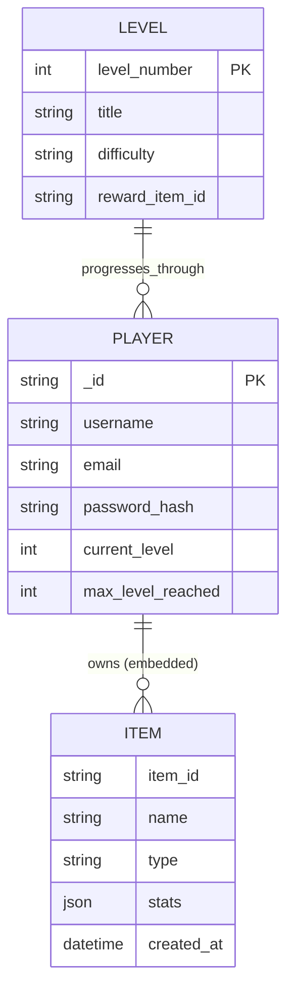

## 🗄️ Entity-Relationship Diagram

```mermaid
erDiagram
  LEVEL {
    int level_number PK
    string title
    string difficulty
    string reward_item_id
  }
  PLAYER {
    string _id PK
    string username
    string email
    string password_hash
    int current_level
    int max_level_reached
  }
  ITEM {
    string item_id
    string name
    string type
    json stats
    datetime created_at
  }
  LEVEL ||--o{ PLAYER : "progresses_through"
  PLAYER ||--o{ ITEM : "owns (embedded)"
```
